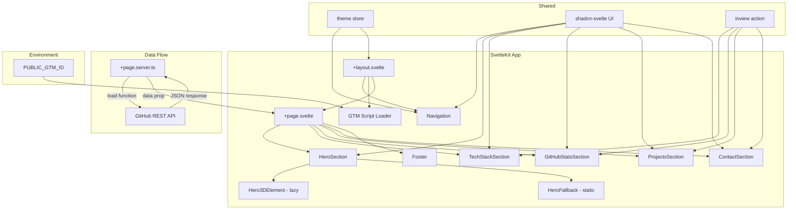
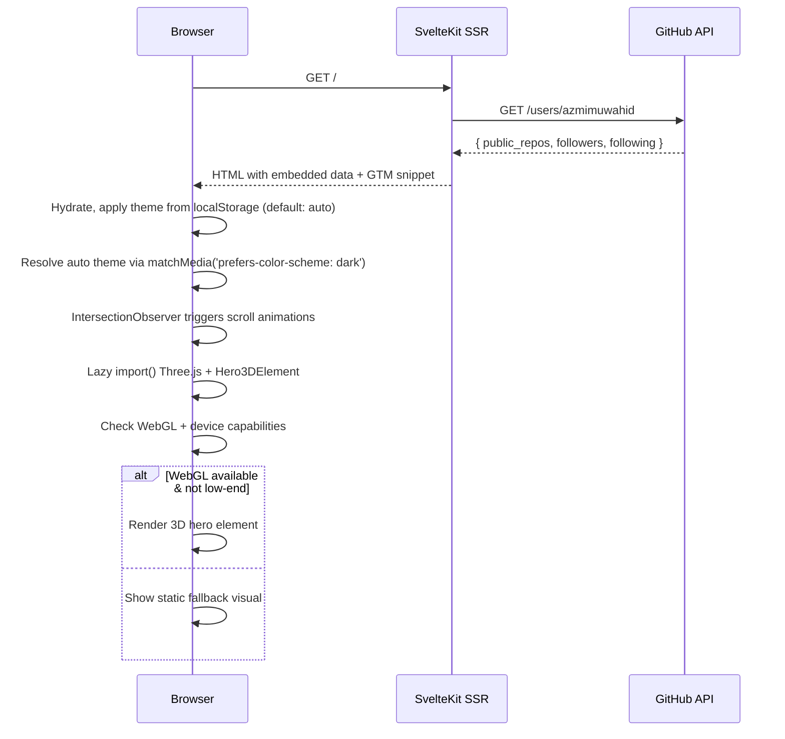
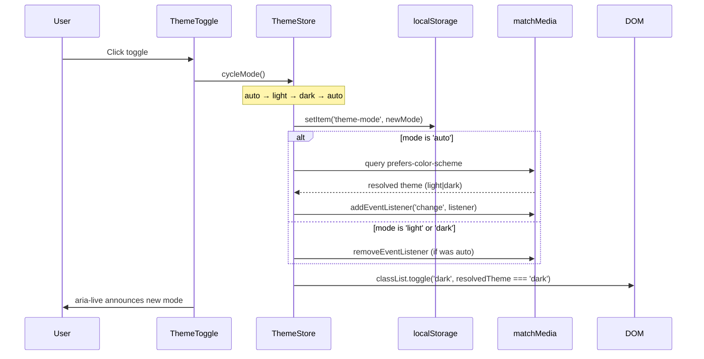
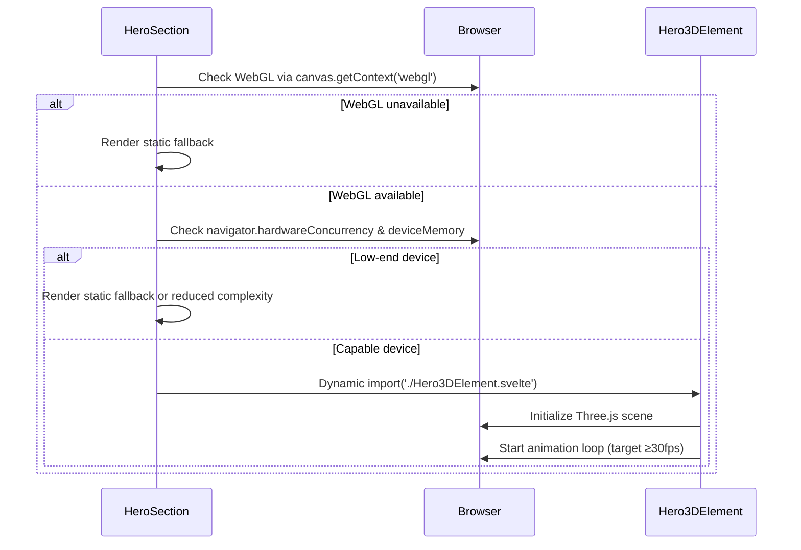

# Design Document: Portfolio Revamp

## Overview

This design covers the complete revamp of the portfolio at azmi.web.id from a generic developer portfolio into a focused, professional showcase for Azmi Muwahid as a Senior Full Stack Engineer specializing in AI-powered EdTech. The application is a single-page SvelteKit 2 + Svelte 5 + Tailwind CSS 4 site deployed on Netlify, using shadcn-svelte as the component library throughout.

The revamp replaces the existing sections (Hero, About, Portfolio, Contact) with new purpose-built sections: Hero (with 3D element), Tech Stack, GitHub Stats, Projects, and Contact. A sticky navigation with smooth scrolling, a tri-state theme toggle (auto/light/dark) persisted in localStorage, Google Tag Manager integration, and responsive mobile-first layout tie everything together.

Key design decisions:
- **shadcn-svelte everywhere**: All UI primitives (Button, Card, Badge, Sheet, Separator, Toggle, Tooltip) come from shadcn-svelte. No manual component building.
- **GitHub REST API at build/load time**: Stats fetched server-side via `+page.server.ts` load function, with client-side session caching and graceful fallback.
- **Intersection Observer animations**: Scroll-triggered entrance animations using a reusable Svelte action, replacing the current per-component observer boilerplate.
- **Auto theme default**: The theme store defaults to `auto` mode, which follows the OS `prefers-color-scheme` preference. The store tracks both the user-selected mode (`auto`|`light`|`dark`) and the resolved theme (`light`|`dark`).
- **Semantic HTML + ARIA**: `<header>`, `<nav>`, `<main>`, `<section>`, `<footer>` structure with proper ARIA labels on icon-only elements.
- **Three.js lazy-loaded hero**: The 3D hero element uses `@threlte/core` with Three.js, loaded via dynamic `import()` to keep it out of the initial bundle. WebGL and device capability checks gate rendering.
- **GTM via env var**: Google Tag Manager loads conditionally from `PUBLIC_GTM_ID`, with async script and noscript fallback.
- **Performance-first**: Bundle splitting, image optimization (WebP/AVIF with dimensions), font-display: swap, and lazy loading ensure Core Web Vitals targets are met.

## Architecture



### Page Load Flow



### Theme Toggle Flow (Tri-State)



### Hero 3D Element Load Flow



## Components and Interfaces

### Page-Level Components

#### `+page.server.ts` (new)
Server-side load function that fetches GitHub stats.

```typescript
interface GitHubStats {
  publicRepos: number;
  followers: number;
  following: number;
  avatarUrl: string;
}

interface PageData {
  githubStats: GitHubStats | null;
}

// load() fetches from https://api.github.com/users/azmimuwahid
// Returns { githubStats } or { githubStats: null } on failure
```

#### `+page.svelte` (modified)
Replaces current sections with new ones. Receives `data` from server load.

```svelte
<!-- Sections in order -->
<HeroSection />
<TechStackSection />
<GitHubStatsSection stats={data.githubStats} />
<ProjectsSection />
<ContactSection />
<Footer />
```

#### `+layout.svelte` (modified)
Adds SEO meta tags, Open Graph tags. Initializes theme store (auto mode default). Conditionally loads GTM script based on `PUBLIC_GTM_ID` env var.

### Section Components (all in `src/lib/components/sections/`)

#### `HeroSection.svelte` (replaces Hero.svelte)
- Uses shadcn `Button` for CTAs ("View Projects" → #projects, "Get in Touch" → #contact)
- Uses shadcn `Badge` for achievement highlights
- Social links (LinkedIn, GitHub, Email) with `aria-label` on each icon link
- Displays: name, title, tagline, achievements, CTA buttons, social links
- Checks WebGL availability and device capabilities
- Lazy-loads `Hero3DElement.svelte` via dynamic `import()` when capable
- Falls back to `HeroFallback.svelte` (static gradient/SVG visual) when WebGL unavailable or low-end device

#### `Hero3DElement.svelte` (new, lazy-loaded)
- Loaded only via `import('$lib/components/sections/Hero3DElement.svelte')`
- Uses `@threlte/core` (`Canvas`, `T`) with Three.js for 3D particle/geometric scene
- Responds to mouse position via `mousemove` event listener
- Targets ≥30fps; uses `requestAnimationFrame` loop
- Renders as an overlay within the hero section (`position: absolute`, `pointer-events: none`)
- Cleans up Three.js resources on component destroy

#### `HeroFallback.svelte` (new)
- Static visual fallback: CSS gradient, SVG pattern, or static image
- Displayed when WebGL is unavailable or device is low-end
- Lightweight, no JavaScript dependencies

#### `TechStackSection.svelte` (replaces About.svelte)
- Uses shadcn `Card` + `Badge` for each skill category
- Categories: Languages, Frontend, Backend, Cloud & DevOps, Database, AI/ML
- Each category is a Card with Badge items for individual skills
- Scroll-triggered entrance animation via `inview` action
- Uses shadcn `Separator` between category groups

#### `GitHubStatsSection.svelte` (new)
- Receives `stats: GitHubStats | null` as prop
- Uses shadcn `Card` for each stat (repos, followers, following)
- Fallback UI when stats is null: shows placeholder values + "Data unavailable" message
- Session-level caching handled by SvelteKit's load function (runs once per navigation)

#### `ProjectsSection.svelte` (replaces Portfolio.svelte)
- Uses shadcn `Card` for project cards
- Uses shadcn `Badge` for technology tags
- Uses shadcn `Button` for demo/source links (open in new tab with `target="_blank"` + `rel="noopener noreferrer"`)
- Featured project: AI-powered mentorship platform at FutureLab.my
- Each card: title, description, tech badges, optional live/source links

#### `ContactSection.svelte` (replaces Contact.svelte)
- Uses shadcn `Card` for the contact info container
- Uses shadcn `Button` for social link buttons
- Uses shadcn `Badge` for current interests
- Displays: email link, LinkedIn, GitHub, portfolio URL
- Shows availability message for EdTech, AI, full-stack opportunities
- Shows current interests: Advanced system design, Kubernetes, ML engineering
- Removes the contact form (not in requirements)

#### `Footer.svelte` (extracted from Contact.svelte)
- Simple footer with copyright and quick links
- Uses shadcn `Separator` for visual divider

### Navigation Component (modified `Navigation.svelte`)

- Uses shadcn `Button` (variant="ghost") for nav links
- Uses shadcn `Sheet` for mobile hamburger menu (replaces custom mobile menu)
- Updated nav items: Home, Tech Stack, GitHub, Projects, Contact
- Keeps existing scroll detection and active section highlighting
- Theme toggle integrated in nav bar

### Theme Toggle (modified `ThemeToggle.svelte`)

- Uses shadcn `Toggle` or `Button` (variant="outline") as the toggle wrapper
- Cycles through three modes: auto → light → dark → auto
- Displays three distinct icons:
  - `Sun` icon when mode is `light`
  - `Moon` icon when mode is `dark`
  - `Monitor` (or `MonitorSmartphone`) icon when mode is `auto`
- Adds `aria-live="polite"` region to announce theme mode changes to screen readers
- Smooth icon transition animation between states

### GTM Integration (new, in `+layout.svelte` or `src/lib/components/GtmScript.svelte`)

- Reads `PUBLIC_GTM_ID` from `$env/static/public`
- If `PUBLIC_GTM_ID` is set and non-empty:
  - Injects GTM `<script>` tag asynchronously in `<svelte:head>`
  - Injects GTM `<noscript>` iframe fallback after `<body>` opening via `app.html` or layout
- If `PUBLIC_GTM_ID` is empty/undefined: renders nothing, no errors
- Script loading is async to avoid blocking page render

```typescript
// In +layout.svelte or GtmScript.svelte
import { PUBLIC_GTM_ID } from '$env/static/public';

// Only render GTM tags when ID is present
const gtmEnabled = !!PUBLIC_GTM_ID && PUBLIC_GTM_ID.trim().length > 0;
```

### Shared Utilities

#### `src/lib/actions/inview.ts` (new)
Reusable Svelte action for IntersectionObserver-based scroll animations.

```typescript
interface InviewOptions {
  threshold?: number;
  rootMargin?: string;
  once?: boolean;
}

// Usage: <div use:inview={{ threshold: 0.2 }} on:inview={handleInview}>
// Dispatches 'inview' event when element enters viewport
```

#### `src/lib/utils/device.ts` (new)
Device capability detection for 3D rendering decisions.

```typescript
interface DeviceCapabilities {
  webglAvailable: boolean;
  isLowEnd: boolean;
  hardwareConcurrency: number;
  deviceMemory: number | undefined;
}

function detectCapabilities(): DeviceCapabilities;
function isWebGLAvailable(): boolean;
function isLowEndDevice(): boolean;
// Low-end: hardwareConcurrency <= 2 OR deviceMemory <= 2
```

### shadcn-svelte Components Required

Components to install via `npx shadcn-svelte@latest add`:
- `button` (already installed)
- `card`
- `badge`
- `sheet` (for mobile nav)
- `separator`
- `toggle`
- `tooltip` (for social link hover labels)


## Data Models

### GitHub Stats

```typescript
// Fetched from GitHub REST API: GET /users/azmimuwahid
interface GitHubUserResponse {
  login: string;
  avatar_url: string;
  public_repos: number;
  followers: number;
  following: number;
}

// Transformed for component consumption
interface GitHubStats {
  publicRepos: number;
  followers: number;
  following: number;
  avatarUrl: string;
}

// Fallback values when API fails
const FALLBACK_STATS: GitHubStats = {
  publicRepos: 0,
  followers: 0,
  following: 0,
  avatarUrl: ''
};
```

### Tech Stack Data

```typescript
interface SkillCategory {
  name: string;        // e.g. "Languages", "Frontend"
  icon: ComponentType; // Lucide icon component
  skills: string[];    // e.g. ["TypeScript", "JavaScript", "Ruby", "Go"]
}

// Static data, defined inline in TechStackSection.svelte
const TECH_CATEGORIES: SkillCategory[] = [
  { name: 'Languages', icon: Code, skills: ['TypeScript', 'JavaScript', 'Ruby', 'Go'] },
  { name: 'Frontend', icon: Layout, skills: ['React', 'Next.js', 'Vue.js', 'Redux', 'Tailwind', 'Svelte'] },
  { name: 'Backend', icon: Server, skills: ['Rails', 'Node.js', 'Express'] },
  { name: 'Cloud & DevOps', icon: Cloud, skills: ['AWS', 'Docker', 'Terraform', 'GitHub Actions'] },
  { name: 'Database', icon: Database, skills: ['PostgreSQL', 'MongoDB', 'Redis'] },
  { name: 'AI/ML', icon: Brain, skills: ['OpenAI'] }
];
```

### Project Data

```typescript
interface Project {
  title: string;
  description: string;
  techTags: string[];
  liveUrl?: string;
  sourceUrl?: string;
  featured: boolean;
}

// Static data, defined inline in ProjectsSection.svelte
const PROJECTS: Project[] = [
  {
    title: 'AI-Powered Mentorship Platform',
    description: 'Intelligent mentorship matching and tracking system at FutureLab.my...',
    techTags: ['SvelteKit', 'OpenAI', 'PostgreSQL', 'AWS'],
    liveUrl: 'https://futurelab.my',
    featured: true
  },
  // ... additional projects
];
```

### Navigation Data

```typescript
interface NavItem {
  name: string;
  href: string;
  sectionId: string;
}

const NAV_ITEMS: NavItem[] = [
  { name: 'Home', href: '#hero', sectionId: 'hero' },
  { name: 'Tech Stack', href: '#tech-stack', sectionId: 'tech-stack' },
  { name: 'GitHub', href: '#github-stats', sectionId: 'github-stats' },
  { name: 'Projects', href: '#projects', sectionId: 'projects' },
  { name: 'Contact', href: '#contact', sectionId: 'contact' }
];
```

### Theme State (updated for tri-state)

```typescript
// Updated store in src/lib/stores/theme.ts
type ThemeMode = 'auto' | 'light' | 'dark';
type ResolvedTheme = 'light' | 'dark';

interface ThemeState {
  mode: ThemeMode;           // User-selected mode
  resolvedTheme: ResolvedTheme; // Actual applied theme (auto resolves via OS)
}

// Store: writable<ThemeState>
// Default mode: 'auto'
// Persisted in: localStorage key 'theme-mode'
// Cycle order: auto → light → dark → auto

// cycleMode(): advances mode to next in cycle
// getResolvedTheme(mode, osPreference): resolves mode to light|dark
// When mode is 'auto': listens to matchMedia('(prefers-color-scheme: dark)') changes
```

### Device Capabilities

```typescript
interface DeviceCapabilities {
  webglAvailable: boolean;
  isLowEnd: boolean;
  hardwareConcurrency: number;
  deviceMemory: number | undefined; // navigator.deviceMemory (Chrome only)
}

// Low-end thresholds:
// hardwareConcurrency <= 2 OR deviceMemory <= 2 (GB)
```

### GTM Configuration

```typescript
// Read from $env/static/public
// PUBLIC_GTM_ID: string — e.g. "GTM-XXXXXXX"
// Empty or missing = GTM disabled
```

### SEO Meta Data

```typescript
interface SEOMeta {
  title: string;       // "Azmi Muwahid — Senior Full Stack Engineer"
  description: string; // "Portfolio of Azmi Muwahid, Senior Full Stack Engineer..."
  ogTitle: string;
  ogDescription: string;
  ogUrl: string;       // "https://azmi.web.id"
}
```


## Correctness Properties

*A property is a characteristic or behavior that should hold true across all valid executions of a system — essentially, a formal statement about what the system should do. Properties serve as the bridge between human-readable specifications and machine-verifiable correctness guarantees.*

### Property 1: Theme mode cycle is deterministic

*For any* starting theme mode in {auto, light, dark} and any number of toggle activations N, the resulting mode should equal the mode at position `(startIndex + N) % 3` in the cycle [auto, light, dark]. Specifically, toggling 3 times from any starting mode should return to that same mode (periodicity).

**Validates: Requirements 3.1, 3.2**

### Property 2: Theme mode persistence round-trip

*For any* theme mode value in {auto, light, dark}, persisting it to localStorage and then initializing a new theme store from that localStorage value should produce the same mode. This is a serialization round-trip: `load(persist(mode)) === mode`.

**Validates: Requirements 3.5, 3.6**

### Property 3: Auto mode resolves to OS preference

*For any* OS color scheme preference (light or dark), when the theme mode is set to `auto`, the resolved theme should equal the OS preference. That is, `resolveTheme('auto', osPreference) === osPreference` for all `osPreference ∈ {light, dark}`.

**Validates: Requirements 3.3**

### Property 4: Theme icon matches mode

*For any* theme mode in {auto, light, dark}, the rendered ThemeToggle should display exactly the icon designated for that mode: Sun for light, Moon for dark, Monitor for auto. No two modes should share the same icon.

**Validates: Requirements 3.8**

### Property 5: GitHub stats display completeness

*For any* valid GitHubStats object with arbitrary non-negative integer values for publicRepos, followers, and following, the rendered GitHubStatsSection should contain string representations of all three numeric values.

**Validates: Requirements 5.2**

### Property 6: Project card rendering completeness

*For any* valid Project object, the rendered project card should contain the project title, description, and every technology tag. If the project has a liveUrl or sourceUrl, the corresponding link element should be present with `target="_blank"` and `rel="noopener noreferrer"` attributes.

**Validates: Requirements 6.2, 6.4**

### Property 7: Icon-only interactive elements have accessible labels

*For any* rendered interactive element (button or anchor) that contains only an icon (no visible text content), that element should have a non-empty `aria-label` attribute.

**Validates: Requirements 10.1**

### Property 8: Theme color contrast compliance

*For any* text/background color pair defined in the theme CSS custom properties (both light and dark variants), the WCAG contrast ratio should be at least 4.5:1 for normal text.

**Validates: Requirements 10.3**

### Property 9: Low-end device detection

*For any* combination of `hardwareConcurrency` (0–32) and `deviceMemory` (undefined, 0.25–8), the `isLowEndDevice()` function should return `true` if and only if `hardwareConcurrency <= 2` OR `deviceMemory <= 2`. The function should never throw regardless of input values.

**Validates: Requirements 11.6**

### Property 10: GTM script omitted when ID is empty

*For any* falsy or whitespace-only `PUBLIC_GTM_ID` value (empty string, undefined, null, whitespace), the GTM component should render no `<script>` tags and no `<noscript>` iframes. The page should load without errors.

**Validates: Requirements 12.5**

### Property 11: Image elements have optimization attributes

*For any* `` element rendered in the Portfolio_App, it should have explicit `width` and `height` attributes (to prevent CLS) and a `loading="lazy"` attribute (except for above-the-fold hero images which may use `loading="eager"`).

**Validates: Requirements 13.5**

## Error Handling

### GitHub API Failures

- **Network errors / HTTP errors**: The `+page.server.ts` load function wraps the fetch in a try-catch. On any failure (network timeout, 4xx, 5xx), it returns `{ githubStats: null }`.
- **Component fallback**: `GitHubStatsSection` checks if `stats` is null. When null, it renders fallback placeholder values (0 for all counts) and a "Data currently unavailable" message using a muted text style.
- **No error propagation**: GitHub API failures must never prevent the page from rendering. The load function always returns successfully.

### Theme Store Edge Cases

- **Corrupted localStorage**: If `localStorage.getItem('theme-mode')` returns a value other than 'auto', 'light', or 'dark', the store defaults to 'auto'.
- **localStorage unavailable**: The store checks `browser` from `$app/environment` before accessing localStorage. On the server, it defaults to 'auto' with resolved theme 'light'.
- **No stored preference**: Defaults to 'auto' mode (Requirement 3.7), which resolves via OS preference.
- **matchMedia unavailable**: If `window.matchMedia` is not available (SSR or old browser), auto mode resolves to 'light' as a safe default.
- **OS preference change while not in auto mode**: The matchMedia listener is only active when mode is 'auto'. Switching away from auto removes the listener to avoid unnecessary updates.

### Hero 3D Element Failures

- **WebGL unavailable**: `isWebGLAvailable()` checks by creating a temporary canvas and calling `getContext('webgl')` or `getContext('webgl2')`. If both return null, the static fallback is shown. The check canvas is immediately discarded.
- **Low-end device**: `isLowEndDevice()` checks `navigator.hardwareConcurrency` and `navigator.deviceMemory`. If either indicates a low-end device, the static fallback is shown instead of the 3D element.
- **Three.js import failure**: The dynamic `import()` is wrapped in a try-catch. If the import fails (e.g., network error for chunk), the static fallback is shown.
- **Runtime WebGL crash**: The Three.js renderer is wrapped in error handling. If the WebGL context is lost, the component gracefully degrades to the static fallback.
- **Frame rate degradation**: No automatic detection in initial implementation. The 30fps target is a design goal validated during development, not enforced at runtime.

### GTM Integration Failures

- **Missing env var**: When `PUBLIC_GTM_ID` is empty, undefined, or whitespace-only, the GTM component renders nothing. No script tags, no iframes, no console errors.
- **GTM script load failure**: The GTM script is loaded with `async` attribute. If the external GTM script fails to load (network error, blocked by ad blocker), the page continues to function normally. GTM failures are silent.
- **Invalid GTM ID format**: No validation of the GTM ID format. If an invalid ID is provided, GTM simply won't initialize, which is harmless.

### Missing Project Data

- **Optional links**: Project cards gracefully handle missing `liveUrl` or `sourceUrl` by not rendering the corresponding button. No broken links.
- **Empty tech tags**: If a project has an empty `techTags` array, the tags section is simply not rendered.

### Navigation

- **Missing section elements**: The smooth-scroll handler checks if the target element exists via `document.getElementById()` before calling `scrollIntoView()`. If the element doesn't exist, the click is a no-op.

### Performance Edge Cases

- **Images without dimensions**: All `` tags must include `width` and `height` attributes to prevent CLS. The build process should flag any images missing these attributes.
- **Font loading**: `font-display: swap` ensures text remains visible during font load. FOUT (Flash of Unstyled Text) is acceptable; FOIT (Flash of Invisible Text) is not.

## Testing Strategy

### Testing Framework

- **Unit/Component tests**: Vitest (already configured in the project)
- **Property-based tests**: `fast-check` library with Vitest
- **Component rendering**: `@testing-library/svelte` for rendering Svelte components in tests

### Property-Based Tests

Each correctness property maps to a single property-based test using `fast-check`. Minimum 100 iterations per test.

| Property | Test Description | Generator Strategy |
|----------|-----------------|-------------------|
| Property 1: Theme mode cycle | Generate random starting modes and toggle counts, verify cycle position | `fc.constantFrom('auto', 'light', 'dark')` + `fc.nat({ max: 100 })` for toggle count |
| Property 2: Theme persistence round-trip | Generate random modes, persist then load, verify equality | `fc.constantFrom('auto', 'light', 'dark')` |
| Property 3: Auto mode resolves OS preference | Generate random OS preferences, verify auto resolves correctly | `fc.constantFrom('light', 'dark')` for OS preference |
| Property 4: Theme icon matches mode | Generate random modes, verify correct icon rendered | `fc.constantFrom('auto', 'light', 'dark')` |
| Property 5: GitHub stats display | Generate random non-negative integers for stats, verify all appear in output | `fc.record({ publicRepos: fc.nat(), followers: fc.nat(), following: fc.nat() })` |
| Property 6: Project card rendering | Generate random Project objects, verify content completeness | `fc.record({ title: fc.string({minLength:1}), description: fc.string({minLength:1}), techTags: fc.array(fc.string({minLength:1})), ... })` |
| Property 7: Accessible icon labels | Render components, query all icon-only interactive elements, verify aria-label | Component rendering + DOM query |
| Property 8: Color contrast | Extract color pairs from CSS variables, compute WCAG contrast ratio | `fc.constantFrom(...colorPairs)` + contrast ratio calculation |
| Property 9: Low-end device detection | Generate random hardwareConcurrency and deviceMemory values, verify detection logic | `fc.record({ cores: fc.integer({min:0, max:32}), memory: fc.oneof(fc.constant(undefined), fc.double({min:0.25, max:8})) })` |
| Property 10: GTM skip on empty ID | Generate falsy/whitespace GTM IDs, verify no script rendered | `fc.oneof(fc.constant(''), fc.constant(undefined), fc.stringOf(fc.constant(' ')))` |
| Property 11: Image optimization attributes | Render page, query all img elements, verify width/height/loading attributes | DOM query over rendered images |

Each test must be tagged with a comment:
```typescript
// Feature: portfolio-revamp, Property 1: Theme mode cycle is deterministic
```

### Unit Tests (Examples and Edge Cases)

Unit tests cover specific examples and edge cases that complement the property tests:

- **Hero content**: Verify "Azmi Muwahid", "Senior Full Stack Engineer", tagline text, achievement badges, social links are present (Requirements 1.1–1.5)
- **Navigation links**: Verify all five section links exist (Requirement 2.2)
- **Theme default**: Verify auto mode when no localStorage value exists (Requirement 3.7, edge case)
- **Theme OS change listener**: Verify that changing OS preference while in auto mode updates resolved theme (Requirement 3.4, example)
- **Tech stack categories**: Verify all six categories with exact skill lists (Requirements 4.1, 4.2)
- **GitHub API URL**: Verify load function fetches from correct endpoint (Requirement 5.1)
- **GitHub fallback**: Verify fallback UI when stats is null (Requirement 5.3, edge case)
- **FutureLab project**: Verify AI mentorship platform is in the project list (Requirement 6.3)
- **Contact info**: Verify email, LinkedIn, GitHub, portfolio links, availability message, interests (Requirements 7.1–7.4)
- **SEO meta tags**: Verify title, description, OG tags are present (Requirements 9.2, 9.3)
- **Semantic HTML**: Verify header, nav, main, section, footer elements (Requirement 9.4)
- **Screen reader announcement**: Verify theme toggle has aria-live region (Requirement 10.4)
- **Hero 3D lazy load**: Verify Three.js component uses dynamic import, not static import (Requirement 11.4)
- **WebGL fallback**: Verify static fallback renders when WebGL is mocked as unavailable (Requirement 11.5, example)
- **GTM script presence**: Verify GTM script tag rendered when PUBLIC_GTM_ID is set (Requirement 12.1, example)
- **GTM env var**: Verify GTM reads from PUBLIC_GTM_ID (Requirement 12.2, example)
- **GTM async**: Verify GTM script has async attribute (Requirement 12.3, example)
- **GTM noscript**: Verify noscript iframe is present when GTM is enabled (Requirement 12.4, example)
- **Font display swap**: Verify font-face declarations use font-display: swap (Requirement 13.6, example)

### Test Configuration

```typescript
// vitest.config.ts additions
// fast-check with numRuns: 100 minimum per property test
// @testing-library/svelte for component rendering
```

### What's NOT Tested via Automated Tests

These requirements are validated through manual testing, Lighthouse audits, or E2E tests:
- Smooth scrolling behavior (Requirement 2.3)
- Mobile hamburger menu responsive breakpoint (Requirement 2.5)
- Scroll-triggered animations (Requirement 4.3)
- Session-level caching of GitHub data (Requirement 5.4)
- Responsive layout breakpoints (Requirements 8.1–8.4)
- SSR rendering mode (Requirement 9.1)
- Keyboard navigation (Requirement 10.2)
- 3D element visual quality and mouse responsiveness (Requirements 11.2, 11.3)
- 30fps frame rate target (Requirement 11.7)
- Core Web Vitals metrics: LCP < 2.5s, FID < 100ms, CLS < 0.1 (Requirements 13.1–13.3)
- Bundle splitting verification (Requirement 13.7)
- Lighthouse score targets: Performance ≥ 90, Accessibility ≥ 90, Best Practices ≥ 90, SEO ≥ 90 (Requirements 14.1–14.4)
